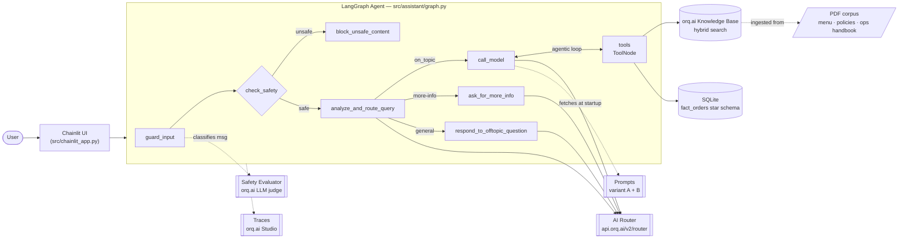
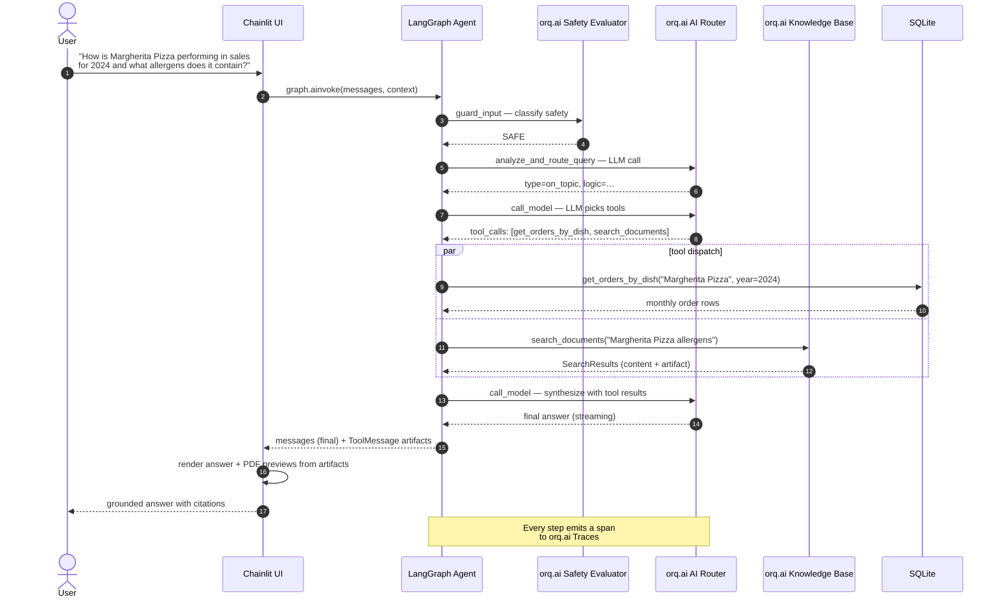
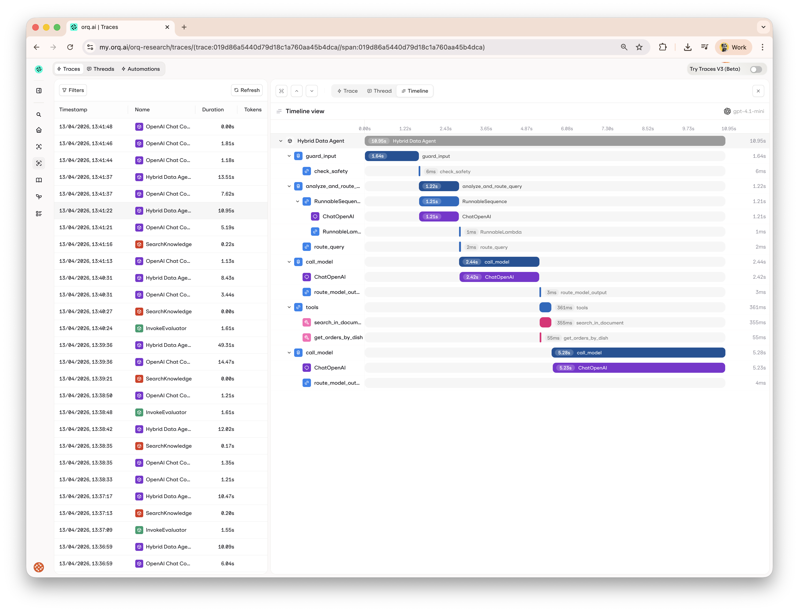
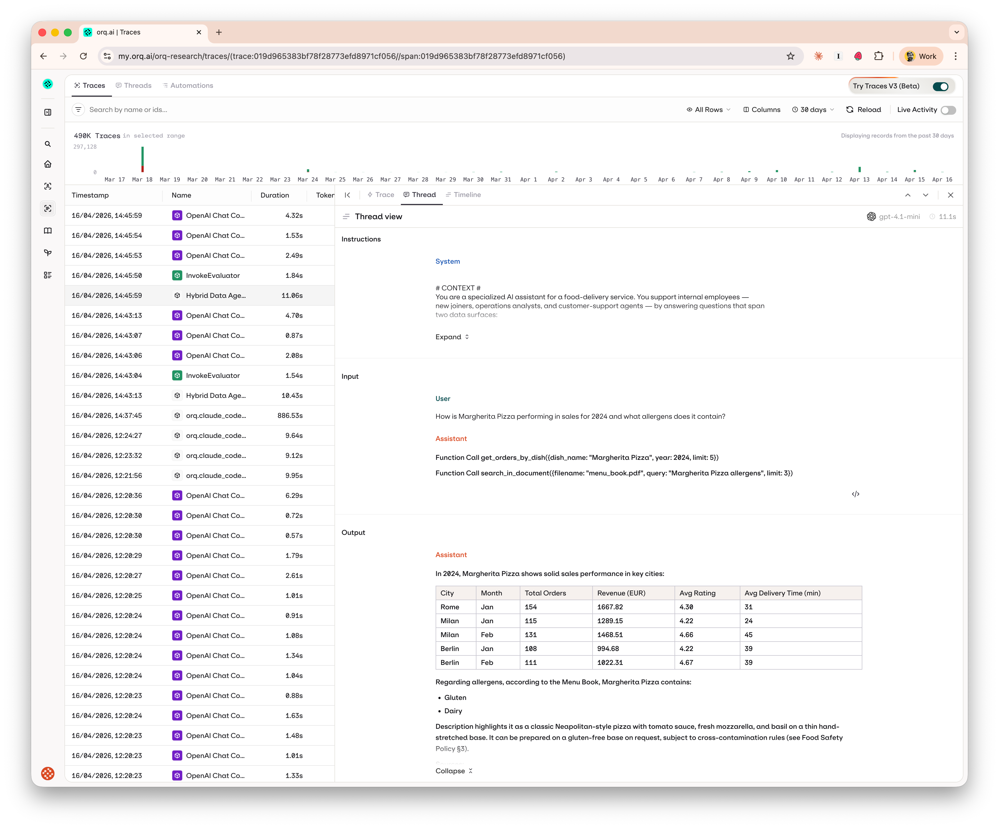

# Architecture

The Hybrid Data Agent is a reference implementation of a conversational AI agent that combines structured data (SQLite delivery orders aggregated at the restaurant × dish × month grain) with unstructured operational documents (menu book, refund/SLA policy, food safety policy, allergen labeling, operations handbook, customer service playbook) in a single LangGraph workflow. Built with LangGraph for agent orchestration, the orq.ai Knowledge Base for managed vector storage, and SQLite for structured data, it demonstrates end-to-end patterns for building agents that reason across multiple data sources, managed through the orq.ai platform. The current dataset is brand-neutral and synthetic — designed as an internal-ops demo for a food-delivery service. Here I document the key architecture decisions.

## Architecture Overview Diagram

The diagram below groups the moving parts by where they *run*: the
**Chainlit UI** and **LangGraph Agent** are Python code in this repo; every
box on the right labeled `[[ ... ]]` is a service on the **orq.ai platform**
that the agent consumes. Every LangGraph node also emits a span that lands
in orq.ai Traces (the dotted line at the bottom) — routed either through
the `orq_ai_sdk.langchain` callback handler (default) or the OpenTelemetry
exporter, depending on `ORQ_TRACING_BACKEND`. See
[LANGGRAPH-INTEGRATION.md](LANGGRAPH-INTEGRATION.md).

## Key Architectural Components

### 1. **Agent Orchestration Layer (LangGraph)**

- **Purpose**: Manages conversation flow, safety, and tool coordination
- **Components**:
  - Safety guardrail (orq.ai LLM Evaluator, with OpenAI Moderation as fallback)
  - Query classification router
  - Tool-calling agent with GPT-4.1-mini routed through the orq.ai AI Router
  - State management for conversation context (TypedDict, serialization-friendly for trace spans)
  - System prompt fetched from orq.ai Prompts at startup (with local fallback)

### 2. **Data Access Layer**

- **Structured Data**: SQLite with a delivery-orders star schema (fact table + 3 dimensions)
  - `fact_orders` — one row per (restaurant × dish × month) with `orders_count`, `revenue_eur`, `avg_rating`, `avg_delivery_minutes`
  - `dim_dish` — 30 dishes across 9 cuisines with prices, calories, allergens
  - `dim_restaurant` — 20 restaurants tied to cities + cuisine types
  - `dim_city` — 10 European cities with country + region
- **Unstructured Data**: orq.ai Knowledge Base (managed embeddings + vector search)
  - 6 operational PDFs: Menu Book, Refund & SLA Policy, Food Safety & Hygiene Policy, Allergen Labeling Policy, Delivery Operations Handbook, Customer Service Playbook. Markdown sources under `docs/sources/`, rendered via `scripts/generate_demo_pdfs.py`.

### 3. **Tool Layer**

- **Individual SQL Tools**: 9 approved queries. Provides SQL injection protection by preventing direct SQL engine exposure to the LLM. All necessary SQL operations are accessible through predefined typed tools that map to parameterized query templates in `sql_schemas.py`.

This approach prioritizes safety over flexibility. In case we see new data needs we need to review the available queries and provide new tools if necessary.

Here is the list of predefined queries and their use:

  - `get_orders_by_dish`: Monthly orders for a specific dish (optionally filtered to a city)
  - `get_orders_by_country`: Orders aggregated by dish/cuisine within a country
  - `get_orders_by_region`: Orders aggregated across a geographic region (pattern-matched)
  - `get_order_trends`: Monthly order trends by cuisine
  - `get_top_dishes`: Top-performing dishes by order count + revenue
  - `get_cuisine_analysis`: Per-cuisine performance breakdown (orders, revenue, rating, delivery time)
  - `compare_dishes_by_restaurant`: All dishes served at a specific restaurant
  - `get_top_cities_by_orders`: City rankings by order volume and revenue
  - `get_cuisine_order_trends`: Monthly trend for a specific cuisine

- **Vector Search Tools**: Semantic search across the 6 operational PDFs. Markdown sources are rendered to PDF via `reportlab`, then ingested into an orq.ai Knowledge Base which handles chunking, embeddings, and hybrid (vector + keyword) search.

### 4. **User Interface Layer**

- **Framework**: Chainlit web application
- **Features**: Streaming responses, PDF display, conversation starters, reference links
- **Deployment**: Docker containerization for easy local development and cloud deployment with CI/CD

## Data Flow Architecture

End-to-end sequence for a single mixed "Margherita sales + allergens"
query. Note that `call_model` and `tools` form an agentic loop — the model
can call tools, look at the results, and call more tools before emitting
the final answer. This is why the same rows can appear multiple times in
the trace tree for complex queries.

## Architecture Trade-offs

> **Note:** This repository is intended as a reference and educational example, not a strict production deployment.

## Observability

All LangGraph executions are traced to the orq.ai Studio. Two backends are
shipped side by side: the `orq_ai_sdk.langchain` callback handler (default)
and an OpenTelemetry exporter (alternative). Switch with `ORQ_TRACING_BACKEND`
in `.env`; see [LANGGRAPH-INTEGRATION.md](LANGGRAPH-INTEGRATION.md) for the
tradeoffs and [`src/assistant/tracing.py`](src/assistant/tracing.py) for the
dispatcher. The Control Tower auto-registers agents, tools, and models from
the spans, and every trace captures the full graph tree — nodes, LLM calls,
tool executions, and Knowledge Base retrievals — with token usage and cost
per step.

The project dashboard and trace tree views are shown in
[README.md#observability](README.md#observability). Two additional views are
useful for deeper analysis:

### Timeline view

View execution as a timeline to spot bottlenecks and measure step durations.

### Thread view

Follow the conversation as a message thread to review how the agent reasoned
through the problem.

## Evaluation & Testing

### **orq.ai Evaluation (evaluatorq)**

- **Dataset Management**: Ground truth dataset with 15 test questions covering SQL-only, document-only, and mixed scenarios
- **Categories Tested**:
  - SQL-only (5 questions): Top dishes, dish performance, cuisine analysis, top cities, monthly cuisine trends
  - Document-only (5 questions): Refund policy, allergen info, driver protocol, food safety temperature bands, escalation flow
  - Mixed (5 questions): Combined SQL + document responses (e.g. "Margherita sales + allergens", "Top dishes + menu ingredients")
- **Scorers** (four dimensions, run per row via [`evals/run_evals.py`](evals/run_evals.py)):
  - `tool-accuracy` — local Python scorer, True iff every expected tool was called
  - `source-citations` — orq.ai LLM judge, True iff factual claims are attributed to a source or the response is a pure refusal/clarification
  - `response-grounding` — orq.ai LLM judge, True iff every claim is supported by the retrieved context (KB chunks AND SQL tool output)
  - `hallucination-check` — orq.ai LLM judge, True iff no claim contradicts the retrievals
- **A/B experiment**: `make evals-compare-prompts` runs the same dataset against two system-prompt variants (managed in orq.ai Prompts) and syncs the comparison to the Studio as a single experiment with the variants side-by-side.

- **See details** at [Evals](EVALS.md).

### Security Architecture Decisions and its layers

|  **Layer** |  **Implementation Status** |  **Protection Against** |
|-----------|---------------------------|------------------------|
| **Input Filtering** | orq.ai LLM Evaluator (guardrail) | Harmful content, illegal activity, prompt injection |
| **Query Routing** | LLM-based topic classification | Off-topic queries, conversation hijacking |
| **Query Templates** | Parameterized query whitelisting | Unauthorized database access |
| **Parameter Validation** | Type-safe parameter checking | Invalid parameters, data corruption |
| **Database Access** | Read-only SQLite connections | Data modification |

#### Layer 1: Input Validation & Content Filtering

- **orq.ai LLM Evaluator Guardrail** (`hybrid-data-agent-safety`):
  First line of defense. A tunable classification prompt running on
  `gpt-4.1-mini` (configurable in the Studio) decides SAFE vs UNSAFE before
  any agent work happens.
- **Tunable in the Studio**: Edit the classification criteria — harmful
  content, illegal activity, prompt injection — without a code change or
  deploy.
- **Auditable**: Every guardrail invocation appears as a span in the trace
  tree under `guard_input`, so blocked queries are visible and reviewable.
- **Fallback**: If `ORQ_SAFETY_EVALUATOR_ID` is unset or the orq.ai call
  fails, the guardrail falls back to the OpenAI Moderation API
  (`src/assistant/guardrails.py` — `OrqSafetyGuardrail` → `OpenAIModerator`).

#### Layer 2: Query Classification & Routing

- **LLM-based Topic Detection**: Identifies query intent and topic relevance
- **Off-topic Protection**: Prevents conversation hijacking and prompt injection
- **Route-specific Security**: Different security measures per query type

#### Layer 3: SQL Security

1. **Predefined SQL queries as Tools** — SQL is not exposed to the LLM; the LLM only knows the typed tool functions.
2. **Template Execution** — parameterized queries with predefined templates only; parameters are validated before binding.

#### Layer 4: Database Security

- **Read-only Access**: Read mode prevents data modification

**Security Trade-offs:**

- **Input Guardrails**: Primary check is an orq.ai LLM evaluator (`hybrid-data-agent-safety`) — tunable in the Studio, auditable via the trace tree. Falls back to the OpenAI Moderation API if the evaluator is unreachable or unconfigured (`ORQ_SAFETY_EVALUATOR_ID` unset).
- **Database Security**: The agent never writes SQL. Each SQL tool maps to a named `query_type` in `sql_schemas.py`, parameters are validated, and the SQLite database is opened `mode=ro`.
- **Off-topic Protection**: Off-topic conversations are a risky vector for prompt injection and jailbreaking. The router node classifies queries as `on_topic` / `more-info` / `general` and only the first path reaches the tool loop.

**Document Serving Security:**

- **Current**: By default Chainlit serves the files under the public directory as static files. Good for a prototype but not for production environment.
- **Recommendation**: Ideally this would be served with something like blob storage or S3 bucket with proper access control and permissions.

## Other considerations

### Cost Optimization

- Implement response caching for common queries
- Use smaller models for classification tasks. We are using GPT-4.1-mini, but we could test with even smaller models for specific classification tasks.
- **Model Routing Strategy**: TODO — enable [orq.ai AI Router auto-routing](https://router.orq.ai/) so LLM calls are dispatched to the cheapest model that still meets the quality bar, with built-in fallbacks and retries. We already route through `https://api.orq.ai/v2/router` (see [`src/assistant/utils.py`](src/assistant/utils.py#L102)), so this is a configuration change in the Router, not a code change.
- **Batch Processing**: Consider using OpenAI Batch API for even lower costs during document ingestion
- Better concurrency management for document ingestion pipeline

### Document Relevancy and Performance

- **Current Approach**: Due to latency and for the sake of simplicity we are showing them [all retrieved documents] here to demonstrate the feature
- **Next immprovement step**: Ideally we would have a relevancy assessment or reranker and filter out those documents that are not relevant

----
