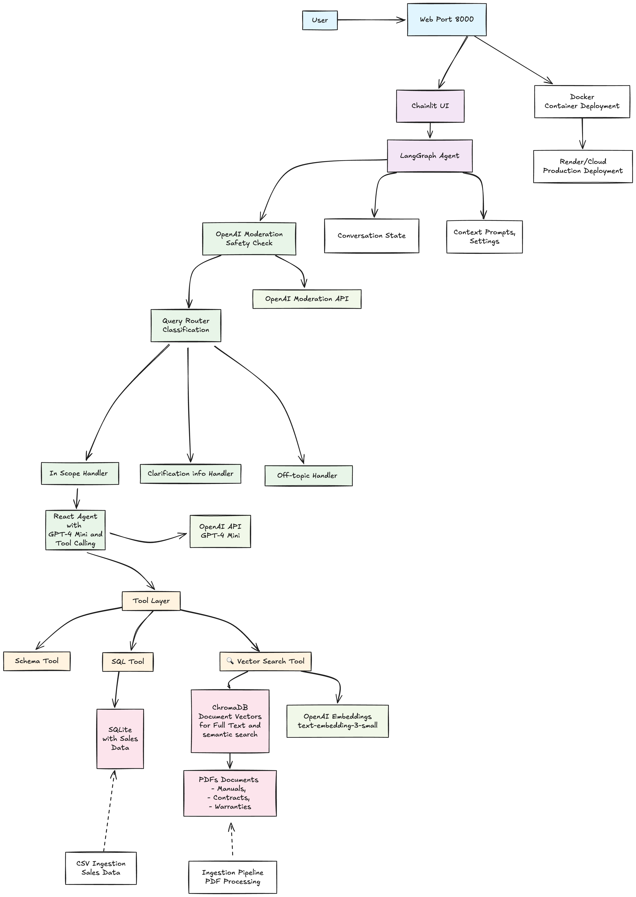
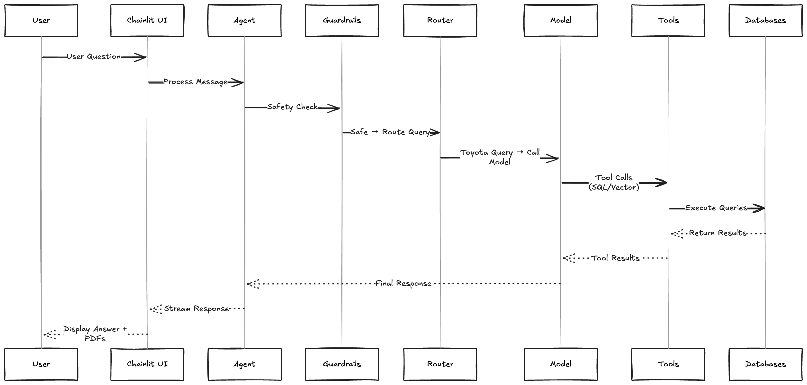

# Architecture

The Toyota RAG Assistant is a PoC for a conversational AI system that combines structured sales data with unstructured documents to provide comprehensive Toyota/Lexus vehicle information that is using the best practices for this type of project. Built using LangGraph for agent orchestration, it demonstrates enterprise-grade RAG architecture patterns.

## Architecture Overview Diagram



## Key Architectural Components

### 1. **Agent Orchestration Layer (LangGraph)**
- **Purpose**: Manages conversation flow, safety, and tool coordination
- **Components**:
  - Safety guardrails (OpenAI Moderation)
  - Query classification router
  - Tool-calling agent with GPT-4.1-mini
  - State management for conversation context

### 2. **Data Access Layer**
- **Structured Data**: SQLite with star schema (fact tables + dimensions)
  - `fact_sales`, `dim_model`, `dim_country`, `dim_ordertype`
- **Unstructured Data**: ChromaDB vector store with OpenAI embeddings
  - PDF documents, manuals, warranties, contracts

### 3. **Tool Layer**
- **Individual SQL Tools**: 10 approved queries. Provides SQL injection protection by preventing direct SQL engine exposure to the LLM.
All necessary SQL operations are accessible through predefined SQL statements exposed as individual tools.

This approach prioritizes safety over flexibility. When new queries are required, they must be defined as new tools.
  - `get_sales_by_model`: Model-specific sales data with country/year filters
  - `get_sales_by_country`: Country-specific sales analysis
  - `get_sales_by_region`: Regional sales comparison and analysis
  - `get_sales_trends`: Monthly sales trends and patterns
  - `get_top_performing_models`: Best-selling models by sales volume
  - `get_powertrain_analysis`: Sales performance by powertrain type
  - `compare_models_by_brand`: Brand-specific model comparisons
  - `get_top_countries_by_sales`: Country rankings by sales performance
  - `get_powertrain_sales_trends`: Powertrain-specific monthly trends
  - `get_database_schema`: Safe database structure information

- **Vector Search Tools**: Semantic search across documents. Available pdfs were ingested and persisted using ChromaDB.

### 4. **User Interface Layer**
- **Framework**: Chainlit web application
- **Features**: Streaming responses, PDF display, conversation starters, reference links
- **Deployment**: Docker containerization for easy local development and cloud deployment with CI/CD

## Data Flow Architecture



## Secure SQL Architecture

The secure SQL implementation follows a multi-layer security approach:

### **Security Components:**
- **Individual SQL Tools**: 10 specific tools with direct parameter mapping
- **SimpleSQLExecutor**: Lightweight parameterized query execution
- **Query Templates**: Predefined SQL queries with parameter placeholders
- **QueryParameters**: Type-safe parameter validation and sanitization

## Architecture Trade-offs Analysis

### **Latency**

**Current Approach:**
- **Sequential Processing**: Safety → Router → Model → Tools → Response
- **Streaming**: Real-time token streaming to UI
- **Quality vs Speed Trade-off**: The current system implementation is more focused on quality of the answer and safety than speed

**Trade-offs:**
| **Advantages** | **Disadvantages**
|-------------------|----------------------|
| Streaming responses provide immediate feedback | Multi-step agent flow adds latency |
| ChromaDB provides fast vector search | OpenAI API calls add network latency |
| SQLite offers instant local queries | Document retrieval can be slow for large PDFs |

**Key Performance Metric:**
- **First-Token-Latency**: ~1 second to start streaming response
- **Total Response Time**: ~1.5-4.5s per interaction
- **Design Philosophy**: *"First make it run, make it better and make it faster"*

**Latency Breakdown:**
- Safety check: ~100-200ms
- Query classification: ~300-500ms
- Tool execution: ~100-400ms
- Response generation: ~1-3s (streaming)

### **Cost**

**Current Cost Structure:**

```
Per 1000 User Interactions (estimated):

OpenAI API Costs:
├── GPT-4o-mini (Router): ~$0.15-0.30
├── GPT-4o-mini (Main): ~$1.50-3.00
├── Embeddings: ~$0.10-0.20
├── Moderation: ~$0.02
└── Total OpenAI: ~$1.77-3.52 (reduced by removing SQL intent parsing)

Infrastructure:
├── Compute (Render/Cloud): ~$7-25/month
├── Storage (ChromaDB): ~$0-10/month
└── Total Infrastructure: ~$7-35/month
```

### **Security**

**Security Measures:**
|  **Layer** |  **Implementation Status** |  **Protection Against** |
|-----------|---------------------------|------------------------|
| **Input Filtering** | OpenAI Moderation API | Harmful content |
| **Query Routing** | LLM-based topic classification | Off-topic queries, conversation hijacking |
| **Parameter Validation** | Type-safe parameter checking | Invalid parameters, data corruption |
| **Query Templates** | Parameterized query whitelisting | Unauthorized database access |
| **Database Access** | Read-only SQLite connections | Data modification |

### **Security Architecture Breakdown**

#### **Layer 1: Input Validation & Content Filtering**
- **OpenAI Moderation API**: First line of defense against harmful content
- **Real-time Processing**: Blocks policy violations before query processing
- **Coverage**: Hate speech, violence, self-harm, sexual content, harassment

#### **Layer 2: Query Classification & Routing**
- **LLM-based Topic Detection**: Identifies query intent and topic relevance
- **Off-topic Protection**: Prevents conversation hijacking and prompt injection
- **Route-specific Security**: Different security measures per query type

#### **Layer 3: Simplified SQL Security (3-Stage Pipeline)**
1. **Direct Tool Selection**: LLM chooses appropriate SQL tool based on the input
3. **Template Execution**: Parameterized queries with predefined templates only

#### **Layer 4: Database Security**
- **Read-only Access**: Read mode prevents data modification

#### **⚡ Layer 5: Runtime Security**
- **Thread Pool Isolation**: Non-blocking async execution
- **Resource Limits**: Memory and timeout constraints
- **Comprehensive Logging**: Security events, attack attempts, performance metrics

**Security Trade-offs:**
- **Input Guardrails**: OpenAI Moderation API filters all incoming messages before processing. It is a simple solution given the time constraints.
- **Database Security**: Individual SQL tools with predefined parameterized queries.
- **Off-topic Protection**: Off-topic conversations are a risky vector for Prompt or SQL injection and jailbreaking. We block that with a router node.

**Document Serving Security:**
- **Current**: By default Chainlit serves the files under the public directory as static files. Good for a prototype but not for production environment.
- **Recommendation**: Ideally this would be served with something like blob storage or S3 bucket with proper access control and permissions.


## Evaluation & Testing

### **LangSmith Integration**
- **Dataset Management**: Ground truth datasets with 15 test questions covering SQL-only, document-only, and mixed scenarios
- **Evaluation Metrics**: Tool selection accuracy, response quality, execution time performance
- **Test Coverage**: 100% perfect tool matches in ground truth dataset with real SQL responses
- **Categories Tested**:
  - SQL-only (5 questions): Model sales, top performers, regional analysis, trends, rankings
  - Document-only (5 questions): Warranty info, maintenance procedures, safety features, repair guides
  - Mixed (5 questions): Combined SQL + document responses
- **Integration Scripts**:
  - `upload_to_langsmith.py`: Dataset registration and management
  - `run_langsmith_evaluation.py`: Automated evaluation pipeline

### **Ground Truth Generation**
- **Real SQL Responses**: Authentic database queries with actual Toyota/Lexus sales data
- **Realistic Document Responses**: Based on actual Toyota documentation and manuals
- **Tool Selection Validation**: Ensures correct tool mapping for different question types
- **Performance Benchmarks**: Execution time and accuracy metrics for regression testing

## Production Readiness

### **Improvements needed for Enterprise deployment**
- **Authentication & Authorization**: No user management
- **Rate Limiting**: No API rate limit implemented
- **Monitoring**: Limited observability beyond logs. Integrate with tools like Sentry, Kibana, Logfire or DataDog.
- **Scalability**: Single-instance architecture
- **Security**: ~~More tests needed to measure robustness against Prompt Injection and SQL Injection.~~ **UPDATED: Simplified SQL tools eliminate injection vectors. Focus now on prompt injection and additional attack vectors.**


### 2. **Cost Optimization**
- Implement response caching for common queries
- Use smaller models for classification tasks. We are using GPT-4o-mini, but we could test with even smaller models for specific classification tasks.
- **Model Routing Strategy**: Consider using [Cast.ai](https://cast.ai/) - a proxy tool that routes to the cheapest model available without compromising quality
- **Batch Processing**: Consider using OpenAI Batch API for even lower costs during document ingestion
- Better concurrency management for document ingestion pipeline

### 3. **More Security**
- Add authentication
- Implement rate limiting per user or IP

### 4. **Enterprise Features**
- Multi-tenant architecture
- Role-based access control
- Advanced monitoring and alerting
- Automated backup strategies

### 5. **Billing Strategy**
- **Usage-Based Billing**: Consider using [Lago](https://www.getlago.com/) - a usage-based billing and metering cloud solution
- **Flexible Pricing Models**: Setup billing by message, tokens, packages, etc.
- **Focus Benefits**: This way we can focus on the system and the billing experimentation until we find the billing model we are happy with

### 6. **Document Relevancy and Performance**
- **Current Approach**: Due to latency and for the sake of simplicity we are showing them [all retrieved documents] here to demonstrate the feature
- **Production Enhancement**: Ideally we would have a relevancy assessment or reranker and filter out those documents that are not relevant
- **Trade-off**: Showing all retrieved documents vs. implementing reranking (adds latency but improves precision)

----

**Quality versus Latency Trade-off**:
The current system implementation is more focused on quality of the answer and safety than speed. I consider that the KPI First-Token-Latency is around 1s, meaing it takes 1 second to start streaming the answer to the user. The trade-off is good ideal for customer iterations and improvements based on actual real usage. Following the principle: First make it run, make it better and make it faster.
