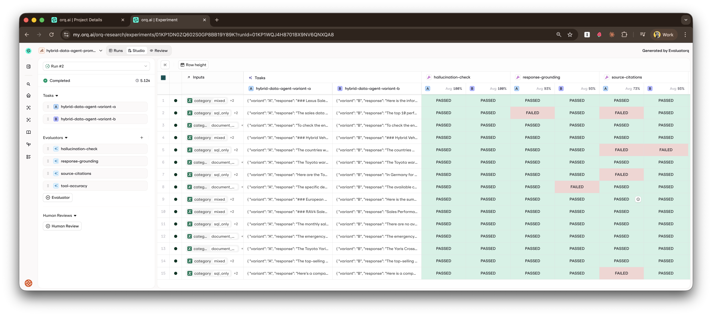

# Hybrid Data Agent Evaluation Pipeline


The evaluation pipeline consists of:

- **Dataset Creation**: Upload test cases to orq.ai
- **Evaluation Execution**: Run the assistant against test cases and measure performance using [evaluatorq](https://docs.orq.ai/docs/experiments/api)
- **Metrics**: Four scorers — `tool-accuracy` (local), `source-citations`, `response-grounding`, `hallucination-check` (orq.ai LLM evaluators)
- **A/B Testing**: Run the same dataset against two system prompt variants in a single experiment to compare scorer results side-by-side


## Quick Start

```bash
# One-time bootstrap: creates the dataset (+ KB + system prompt A & B) on orq.ai.
# Safe to re-run — it reuses existing entities by key.
make setup-workspace

# Run evaluation pipeline (against the local JSONL file by default)
make evals-run

# A/B test the two system prompt variants against the same dataset
make evals-compare-prompts

# Show help for evaluation scripts
make evals-help
```

> `make setup-workspace` is the recommended way to create the dataset.
> `make evals-upload-dataset` still exists and runs only the dataset step —
> use it if you've deleted the dataset in the Studio and want to re-upload.

## Prerequisites

### 1. Install Dependencies

Make sure you have the eval dependencies installed.

```bash
uv sync --group eval
```

### 2. Set Up orq.ai

1. **Create orq.ai Account**: Sign up at [https://my.orq.ai/](https://my.orq.ai/)
2. **Get API Key**: Go to Settings > API Keys > Create API Key
3. **Set Environment Variables**:

```bash
# Add to your .env file
ORQ_API_KEY=your_api_key_here
ORQ_PROJECT_NAME=langgraph-demo   # or any name you prefer
```

4. **Bootstrap the workspace** (creates the dataset, KB, and system prompt):

```bash
make setup-workspace
```

## Dataset Structure

The evaluation dataset (`evals/datasets/tool_calling_evals.jsonl`) contains 15 test cases in JSONL format:

### Test Case Categories

- **SQL-only queries** (5 cases): Questions requiring database queries
- **Document-only queries** (5 cases): Questions requiring document search
- **Mixed queries** (5 cases): Questions requiring both SQL and document search

## Directory Structure

```
evals/
|-- create_eval_dataset.py                # Standalone dataset uploader (make evals-upload-dataset)
|-- run_evals.py                          # Unified entry point — single variant OR A/B
|                                         #   make evals-run                → variant A
|                                         #   make evals-compare-prompts    → --variants A,B
|-- _shared.py                            # Shared helpers: the agent @job factory,
|                                         #   tool extraction, dataset loading, tool_accuracy_scorer
|-- orq_scorers.py                        # LLM-evaluator scorers invoked via /v2/evaluators/{id}/invoke
`-- datasets/
    `-- tool_calling_evals.jsonl          # 15 test cases (sql_only / document_only / mixed)
```

### Example Test Case

```json
{
  "metadata": {
    "id": "sql_001",
    "category": "sql_only",
    "expected_tools": ["get_sales_by_model"]
  },
  "inputs": {
    "category": "sql_only",
    "question": "Show me RAV4 sales in Germany for 2024",
    "expected_tools": ["get_sales_by_model"]
  },
  "outputs": {
    "response": "Based on our sales data, here's how RAV4 performed...",
    "tools_called": ["get_sales_by_model"],
    "execution_status": "success"
  }
}
```

## Step 1: Register the Evaluation Dataset on orq.ai

The recommended way is to run `make setup-workspace` (shown in Prerequisites)
which creates the dataset alongside the KB and system prompt. If you only
want to upload the dataset — e.g. after deleting it in the Studio — you can
use the standalone command:

```bash
make evals-upload-dataset
```

**Expected Output:**
```
Uploading Hybrid Data Agent Dataset to orq.ai
Loading evals/datasets/tool_calling_evals.jsonl...
Loaded 15 examples
Creating dataset: hybrid-data-agent-tool-calling-evals
Uploading 15 datapoints...
Success! Dataset ID: 01ARZ3NDEKTSV4RRFFQ69G5FAV
View at: https://my.orq.ai/datasets/01ARZ3NDEKTSV4RRFFQ69G5FAV
```

## Step 2: Run Evaluation Pipeline

Execute the evaluation against your assistant:

```bash
# Run the single-variant pipeline (variant A, uses the cached default prompt)
make evals-run

# Or call the script directly
uv run python evals/run_evals.py
```

**What this does:**

- Loads the Hybrid Data Agent graph from `src/assistant/`
- Runs each test case through the assistant via an evaluatorq `@job`
- Extracts tool calls and responses
- Evaluates whether the agent called the correct tools (PASS/FAIL per scorer)
- Syncs results to orq.ai for analysis under the project defined by `ORQ_PROJECT_NAME`

**Expected Output:**

```
Hybrid Data Agent Evaluation Pipeline (orq.ai)
==================================================
Loaded 15 datapoints from local file
Starting evaluation...
...
Evaluation completed!
Results available in orq.ai Studio: https://my.orq.ai/experiments
```

## Step 3: A/B Test Prompt Variants

The system prompt lives in orq.ai, so you can compare two versions against
the evaluation dataset without touching code. `make setup-workspace`
creates two variants:

- **Variant A** (`ORQ_SYSTEM_PROMPT_ID`) — the canonical prompt with
  grounding rules, routing instructions, and source-attribution policy.
- **Variant B** (`ORQ_SYSTEM_PROMPT_ID_VARIANT_B`) — a deliberately
  concise version that strips the verbose sections.

Run both through the same 15 datapoints in a single experiment:

```bash
make evals-compare-prompts
```

**What this does** (see [`evals/run_evals.py`](evals/run_evals.py)):

- `--variants A,B` triggers the A/B path: fetches each variant via
  `fetch_prompt_by_id()` and builds one evaluatorq job per variant using
  the shared `make_agent_job()` factory in [`evals/_shared.py`](evals/_shared.py)
- Each job invokes the graph with `Context(system_prompt=...)` overriding
  the cached default, so no code edit is needed to swap prompts
- Runs all four scorers (`tool-accuracy`, `source-citations`,
  `response-grounding`, `hallucination-check`) against both variants
- Syncs results to orq.ai Studio as a single experiment with both
  variants as columns

The single-variant case (`make evals-run` → `--variants A`) is the same
code path with a one-element variants list — no separate script.



**To iterate on a variant:** open the prompt in the orq.ai Studio
(`langgraph-demo → hybrid-data-agent-system-prompt-variant-b`), edit,
click Publish, and re-run `make evals-compare-prompts`. No code change
or redeploy — the experiment picks up the latest published version on
the next run, thanks to `fetch_prompt_by_id()` being called fresh each
time.

## Evaluation Metrics

Each scorer returns `EvaluationResult(value=<bool>, pass_=<bool>, explanation=...)`.
The boolean `value` makes the orq.ai Studio color-code experiment cells
green/red. `pass_` feeds evaluatorq's built-in regression gate, which calls
`sys.exit(1)` if any row fails — useful for CI, noisy for local dev. Both
eval scripts pass `_exit_on_failure=False` so transient LLM-judge flakes
don't kill the make target; failures still surface in the Studio table. Flip
the flag (or wrap the call) in CI to re-enable hard-fail on regression.

### 1. Tool Accuracy Scorer (local)

- **True** (green): All expected tools were called (additional tools are allowed)
- **False** (red): One or more expected tools are missing

Defined in `evals/_shared.py` — stays local because it needs the agent's
`tools_called` output field which isn't part of the standard orq.ai Python
evaluator log surface.

### 2. Source Citations (orq.ai LLM evaluator)

- **True** (green): The response either cites a source document (by name,
  section, or URL), OR is purely conversational (clarification / refusal /
  acknowledgment with no factual claims)
- **False** (red): The response makes specific factual claims (numbers, dates,
  specs, procedures, policy details) **without any attribution**

Registered as a workspace **LLM evaluator** `source-citations-present`
(created by `make setup-workspace`). The prompt is aligned with the
system prompt's *Source Attribution* policy, which instructs the agent
to use phrases like *"According to the [Document Name]..."* or *"Based
on the retrieved sales data..."* rather than URLs — our PDFs don't have
canonical URLs.

Originally this was a Python regex evaluator that looked for `https?://`
URLs in the response. That was wrong for this agent: every response was
red because the agent cites by document name, not URL. The LLM judge
understands both forms and exempts pure refusals, so it actually tracks
whether the agent follows its own attribution policy.

Tune it in the orq.ai Studio — edit the prompt, click Publish, and the
next eval run picks up the change. See
[`scripts/setup_orq_workspace.py`](scripts/setup_orq_workspace.py) for
`SOURCE_CITATIONS_PROMPT`.

### 3. Response Grounding (orq.ai LLM evaluator)

- **True** (green): All claims in the response are supported by the retrieved docs
- **False** (red): The response makes claims not present in the retrievals

Registered as a workspace LLM evaluator `response-grounding`. This scorer
needs the retrievals to work, so the job captures every ToolMessage's
content — KB chunks *and* SQL query results — via
`extract_tool_outputs_from_messages()` in `evals/_shared.py` and passes
them to the evaluator as the `retrievals` field in `orq_scorers.py`.

### 4. Hallucination Check (orq.ai LLM evaluator)

- **True** (green): Response contains no contradictions or unsupported claims vs retrievals
- **False** (red): At least one contradiction or fabrication found

Registered as a workspace LLM evaluator `hallucination-check`. Complements
grounding (grounding = "everything is supported", hallucination = "nothing is
contradicted"). Same retrievals plumbing as the grounding scorer.

## Viewing Results

### orq.ai Studio

1. **Go to**: [https://my.orq.ai/](https://my.orq.ai/)
2. **Navigate to**: Experiments
3. **View**: Experiment results, metrics, and individual test cases

### Key Metrics to Monitor

- **Tool Accuracy** — are the expected tools being called?
- **Source Citations** — does the response attribute its claims?
- **Response Grounding** — are all claims supported by the retrieved context?
- **Hallucination Check** — are any claims contradicted by or absent from the retrievals?
- **A/B delta** — when running `make evals-compare-prompts`, the scorer column deltas between variant A and variant B tell you whether a prompt change is a net win before you publish it.

----
Author: Arian Pasquali
