# Hybrid Data Agent — LangGraph + orq.ai reference implementation

> **A runnable reference implementation showing how to build, observe, and evaluate LangGraph agents on orq.ai.**

This repo is a working example of a LangGraph agent that reasons over both **structured data** (SQLite delivery orders with ~1,700 rows across dishes, restaurants, and cities) and **unstructured documents** (menu book, refund/SLA policy, food safety policy, allergen labeling policy, delivery operations handbook, customer service playbook — stored in the orq.ai Knowledge Base), with the entire dev loop — prompts, retrieval, tracing, evaluation — managed through the orq.ai platform.

## What you'll learn

| orq.ai feature | Problem it solves | Where it lives |
|---|---|---|
| **AI Router** | Multi-provider LLM access, cost tracking, fallbacks, one-line model swaps | [`src/assistant/utils.py`](src/assistant/utils.py) — `load_chat_model()` |
| **Knowledge Base** | Managed RAG — embeddings, chunking metadata, hybrid/vector/keyword search, zero infrastructure | [`scripts/unstructured_data_ingestion_pipeline.py`](scripts/unstructured_data_ingestion_pipeline.py) (ingest) · [`src/assistant/kb_tools.py`](src/assistant/kb_tools.py) (search) |
| **Prompts** | Version system prompts without redeploying; A/B test changes against a dataset | [`src/assistant/prompts.py`](src/assistant/prompts.py) — `get_system_prompt()` |
| **Traces (OTEL)** | Full LangGraph execution tree with cost + latency per node, tool call, and LLM request | [`src/assistant/tracing.py`](src/assistant/tracing.py) — `setup_tracing()` |
| **evaluatorq** | Programmatic PASS/FAIL scorers, CI/CD gating, experiment comparison in the Studio | [`evals/run_evals.py`](evals/run_evals.py) |
| **Datasets** | Versioned test cases, reusable across experiments | [`evals/datasets/tool_calling_evals.jsonl`](evals/datasets/tool_calling_evals.jsonl) |
| **Workspace bootstrap** | Idempotent one-command setup for project + KB + prompt + dataset | [`scripts/setup_orq_workspace.py`](scripts/setup_orq_workspace.py) |

See [ARCHITECTURE.md](ARCHITECTURE.md) for architecture decisions and [EVALS.md](EVALS.md) for the evaluation pipeline.

## What the agent does

- **Query structured order data** — answers questions about delivery performance (top dishes, orders by city, cuisine trends, restaurant rankings) via 9 typed SQL tools
- **Search unstructured operations docs** — semantic search over the menu book, refund/SLA policy, food safety policy, allergen labeling, ops handbook, and customer service playbook
- **Combine both** — agentic tool calling iterates between SQL and document search until it has a grounded answer (e.g. *"How is Margherita Pizza performing and what allergens does it contain?"*)
- **Stay safe** — an orq.ai LLM evaluator classifies every message as SAFE or UNSAFE before any agent work runs, with OpenAI Moderation as a fallback

## Data Sources

- **Order data** (SQLite): `fact_orders` star schema — one row per (restaurant × dish × month) with `orders_count`, `revenue_eur`, `avg_rating`, `avg_delivery_minutes`. Dimensions: `dim_dish` (30 dishes across 9 cuisines with allergens + calories), `dim_restaurant` (20 restaurants across 10 cities), `dim_city`. All synthetic with a fixed random seed for determinism.
- **Operations docs** (orq.ai Knowledge Base): 6 PDFs — Menu Book, Refund & SLA Policy, Food Safety & Hygiene Policy, Allergen Labeling Policy, Delivery Operations Handbook, Customer Service Playbook. Markdown sources live under [`docs/sources/`](docs/sources/) and are rendered to PDF via [`scripts/generate_demo_pdfs.py`](scripts/generate_demo_pdfs.py).

### Example Questions

**Using structured order data:**
- "Top 5 dishes by order count in Berlin last month"
- "Which cuisines are performing best in 2024 by total orders and revenue?"
- "Show me the monthly order trends for Italian cuisine"
- "Top 10 restaurants by total revenue"

**Using unstructured documents:**
- "What is our refund policy for orders delivered more than 60 minutes late?"
- "What allergens are listed for the Margherita Pizza?"
- "How should drivers handle contactless delivery to a non-responsive customer?"
- "What temperature must hot meals stay above during transit?"

**Hybrid:**
- "How is Margherita Pizza performing in sales and what allergens does it contain?"
- "Show me the top 5 dishes in Amsterdam and what the menu book says about their ingredients"
- "Compare Italian and Japanese cuisine performance and what our allergen policy says about typical allergens in each"


## How it works

The assistant uses a multi-step LangGraph workflow with routing:

1. **Safety Check**: An orq.ai LLM evaluator (`hybrid-data-agent-safety`) classifies each user message as SAFE or UNSAFE before any agent work happens. Falls back to the OpenAI Moderation API if the evaluator is unreachable.
2. **Query Analysis**: LLM classifies the question as `on_topic` / `more-info` / `general`
3. **Context-Aware Routing**: Routes to the appropriate response path:
   - **on_topic**: Question is about delivery orders, menu, dishes, restaurants, cities, policies, or operations — the agent uses SQL and document tools to answer
   - **more-info**: Asks for clarification when the scope is ambiguous (e.g. *"tell me about orders"*)
   - **general**: Politely redirects off-topic questions back to delivery-service topics
4. **Agentic Tool Loop**: For on-topic questions, iterates between the model and the tools (KB search + SQL) until it has a grounded answer

The whole flow as a graph:

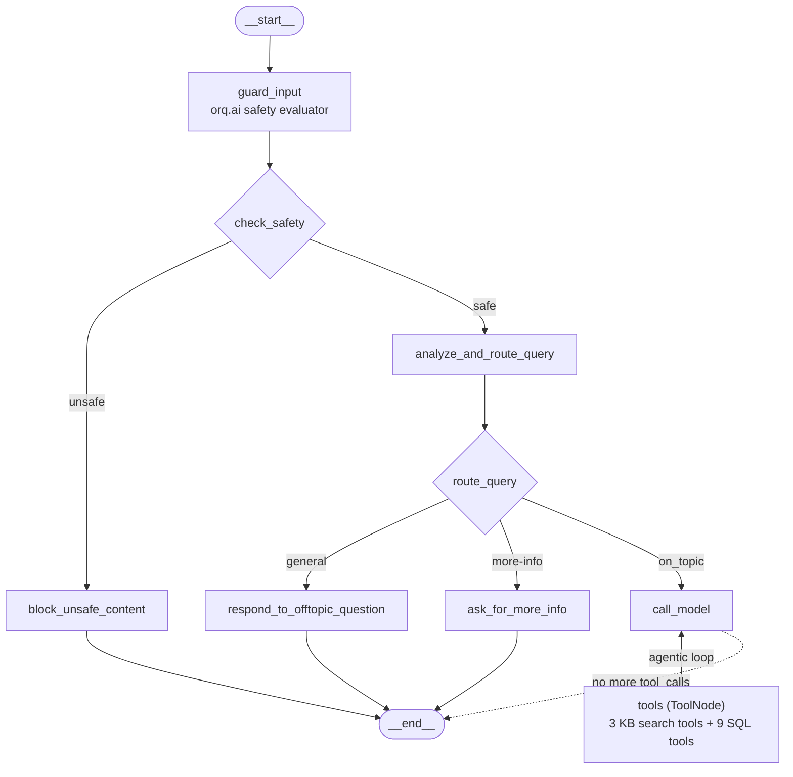

Every box maps 1:1 to a node in [`src/assistant/graph.py`](src/assistant/graph.py).
The `{check_safety}` and `{route_query}` diamonds are LangGraph conditional
edges; the `<-->` between `call_model` and `tools` is the agentic loop the
React-style agent uses to keep calling tools until it has enough context
to answer.

For a detailed technical overview of the system architecture (including
the data-flow sequence diagram for a real query), see [ARCHITECTURE.md](ARCHITECTURE.md).


## Demo

End-to-end walkthrough: the agent fielding a hybrid query that mixes
structured order data (SQL tools) with unstructured policy/menu content
(KB search), then surfacing the cited PDFs in the Chainlit side panel.

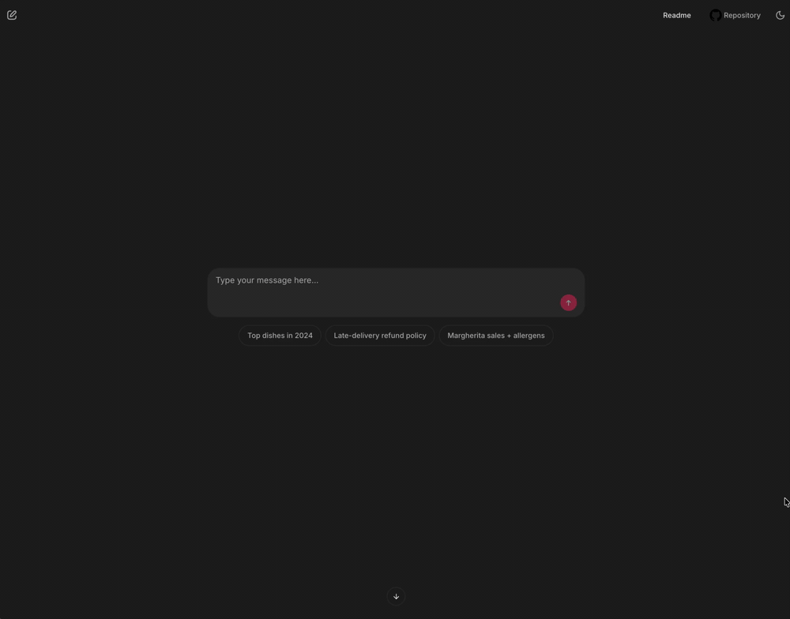


## Quick Start

### Prerequisites

- **Option A (Local, recommended)**: Python 3.11+ and [uv](https://docs.astral.sh/uv/)
- **Option B (Docker)**: Docker and Docker Compose (for running the app only — bootstrap + ingest still run on the host)

**Required API keys** (set in `.env` before running any setup command):
- `OPENAI_API_KEY` — for LLM + embedding generation (ingestion)
- `ORQ_API_KEY` — for orq.ai observability, evaluation, Knowledge Base, and prompts
- `ORQ_PROJECT_NAME` — orq.ai project where datasets, experiments, prompts, and KBs live

**Bootstrap outputs** (populated by `make setup-workspace` — paste the printed block into `.env`):
- `ORQ_KNOWLEDGE_BASE_ID` — Knowledge Base that holds the ingested PDFs
- `ORQ_SYSTEM_PROMPT_ID` — system prompt managed in the Studio (variant A)
- `ORQ_SYSTEM_PROMPT_ID_VARIANT_B` — second prompt variant for `make evals-compare-prompts`
- `ORQ_SAFETY_EVALUATOR_ID` — LLM-judge evaluator that powers the `guard_input` safety node
- `ORQ_SOURCE_CITATIONS_EVALUATOR_ID` — scorer for "does the response cite its sources?"
- `ORQ_GROUNDING_EVALUATOR_ID` — scorer for "are all claims supported by retrieved context?"
- `ORQ_HALLUCINATION_EVALUATOR_ID` — scorer for "does any claim contradict the retrievals?"
- `ORQ_MANAGED_AGENT_KEY` — key of the managed orq.ai Agent that powers `make run-orq-agent`

### Option A: Local Development (Recommended)

1. **Install dependencies**
```bash
uv sync
```

2. **Configure environment**
```bash
cp .env.example .env
# Edit .env and set OPENAI_API_KEY, ORQ_API_KEY, and ORQ_PROJECT_NAME
```

3. **Bootstrap the orq.ai workspace**
```bash
# Idempotent: creates (or reuses) the project, Knowledge Base, system
# prompt, and evaluation dataset under ORQ_PROJECT_NAME, then prints a
# paste-safe block of IDs for your .env file.
make setup-workspace
```

Example output (abridged — the real script runs 10 steps and prints all 8 env vars below the banner):
```
[1/10] Project 'langgraph-demo'
  → created new project: 019...
[2/10] Knowledge Base 'hybrid-data-agent-kb'
  → created new KB: 01K...
[3/10] System prompt 'hybrid-data-agent-system-prompt'
  → created new prompt: 01K...
...
[10/10] Evaluation dataset 'hybrid-data-agent-tool-calling-evals'
  → created new dataset: 01K...

======================================================================
✅ Workspace bootstrap complete
======================================================================

# Paste the block below into your .env file (safe to paste as-is).
# ───────────────────────────────────────────────────────────────
ORQ_KNOWLEDGE_BASE_ID="01K..."
ORQ_SYSTEM_PROMPT_ID="01K..."
ORQ_SYSTEM_PROMPT_ID_VARIANT_B="01K..."
ORQ_SAFETY_EVALUATOR_ID="01K..."
ORQ_SOURCE_CITATIONS_EVALUATOR_ID="01K..."
ORQ_GROUNDING_EVALUATOR_ID="01K..."
ORQ_HALLUCINATION_EVALUATOR_ID="01K..."
ORQ_MANAGED_AGENT_KEY="hybrid-data-agent-managed"
# Dataset ID (not read by the app, informational only):
# ORQ_DATASET_ID=01K...
# ───────────────────────────────────────────────────────────────
```

Copy the entire block into your `.env` file — all 8 variables are needed for
the full workflow (A/B testing, LLM-judge scorers, Approach B). `.env.example`
already has placeholders for every one; `setup-workspace` just fills in the
real IDs.

4. **Ingest data sources**
```bash
# Loads the SQLite sales database and ingests PDFs into the Knowledge
# Base you just bootstrapped. Runs `ingest-sql` + `ingest-kb`.
make ingest-data
```

5. **Run the UI**
```bash
# Web interface. Runs Chainlit UI locally
make run
```
Visit `http://localhost:8000` to chat with the assistant. The welcome
screen shows three starter prompts — one each for SQL-only,
document-only, and mixed (hybrid) queries:

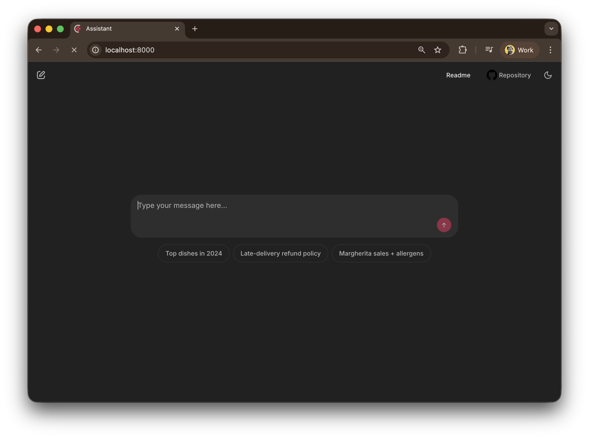

Click any starter (or type your own question) and the agent streams its
tool calls inline as the response comes in. The example below shows the
**mixed** starter — *"How is Margherita Pizza performing in sales for
2024 and what allergens does it contain?"* — combining a SQL query
against `fact_orders` with a Knowledge Base search across the menu and
food-safety policy. The answer renders a city-by-city sales table from
the SQL tool, the allergen text from the Menu Book, and an inline PDF
preview of `food_safety_and_hygiene_policy.pdf` opened to the relevant
page. Citation tags at the bottom link each claim back to its source:

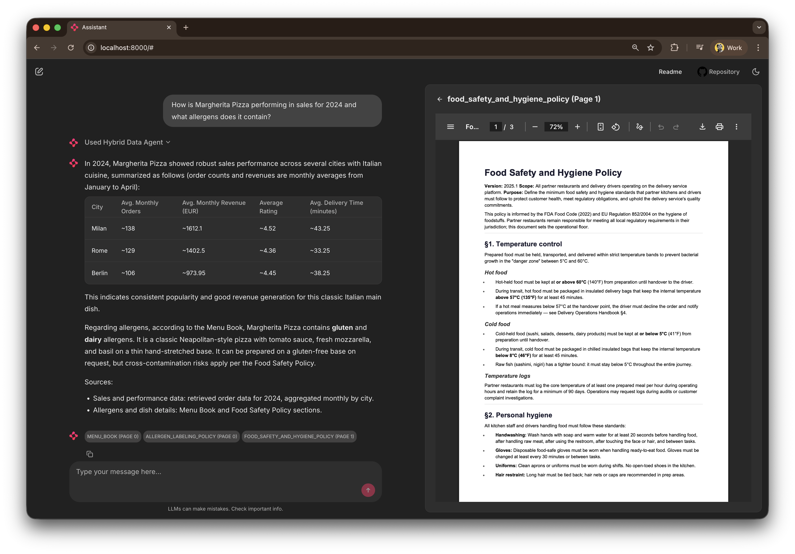

Every node, tool call, and LLM round-trip is also captured in the
orq.ai Studio Traces tab so you can drill into inputs / outputs /
cost / latency at every step (see the [Observability](#observability)
section below).

6. **Run the agent using LangGraph Studio**

```bash
# Opens LangGraph Studio UI running our Agent
make dev
```

LangGraph Studio should automatically open in your browser. From there
you can step through the graph node-by-node, inspect state at each
checkpoint, and replay any historical thread.

### Option B: Docker

Docker is useful once the workspace is bootstrapped and data is ingested.
The container only runs the Chainlit app — it doesn't run setup-workspace
or ingest-data, so make sure those are done first from your host machine.

```bash
# 1. Bootstrap and ingest from the host (see Option A steps 1–4)
make setup-workspace   # then paste IDs into .env
make ingest-data

# 2. Build and run the container
docker-compose up --build
# or
docker build -f Dockerfile -t hybrid-data-agent .
docker run -p 8000:8000 --env-file .env hybrid-data-agent
```

Visit `http://localhost:8000` to chat with the assistant.


## Document Ingestion

Ingest PDF documents into an orq.ai Knowledge Base for semantic retrieval.
Local chunking is done with PyPDF + `RecursiveCharacterTextSplitter`, then
chunks are uploaded to orq.ai which handles embeddings and vector search.

```bash
# Ingest PDFs from ./docs directory into the orq.ai Knowledge Base
make ingest-kb
```

**First run:** if `ORQ_KNOWLEDGE_BASE_ID` is not set in `.env`, `make setup-workspace`
should have created it for you already. If you skipped setup-workspace, `ingest-kb`
will auto-create a KB and print its ID — paste it into `.env` to reuse on subsequent runs.

### Inspecting ingested chunks

After ingestion, open the Knowledge Base in the orq.ai Studio to browse each
datasource (one per PDF) and inspect individual chunks with their metadata.

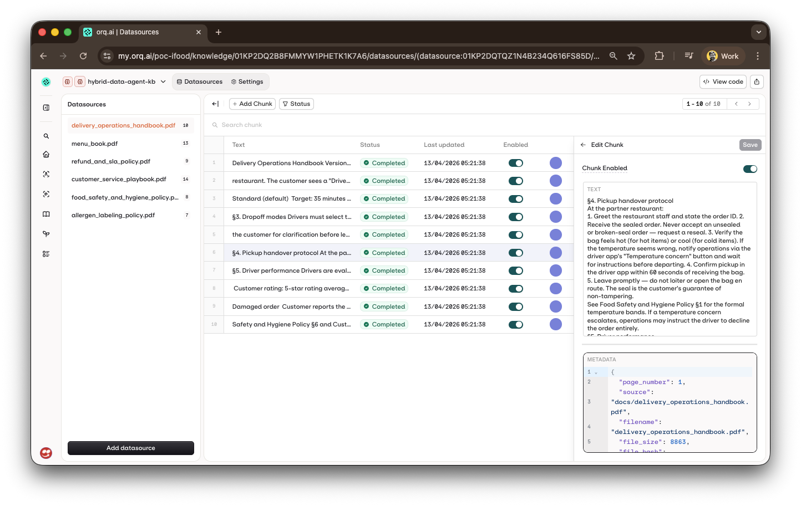

### Testing Knowledge Base search

Use the built-in search playground to verify retrieval quality — tweak
hybrid/vector/keyword modes and thresholds — before wiring the KB to the agent.


## Observability

Every LangGraph execution (from the Chainlit UI, eval runs, or direct
invocation) is traced to the orq.ai Studio via OpenTelemetry. The full graph
tree is captured — nodes, LLM calls, tool executions, and Knowledge Base
retrievals — with token usage and cost per step.

See [`src/assistant/tracing.py`](src/assistant/tracing.py) for the OTEL setup
that makes this work.

### Project dashboard

The Studio's project dashboard rolls everything up: total requests, cost,
P95 latency, and the per-model + per-deployment breakdown across all
traces from this agent.

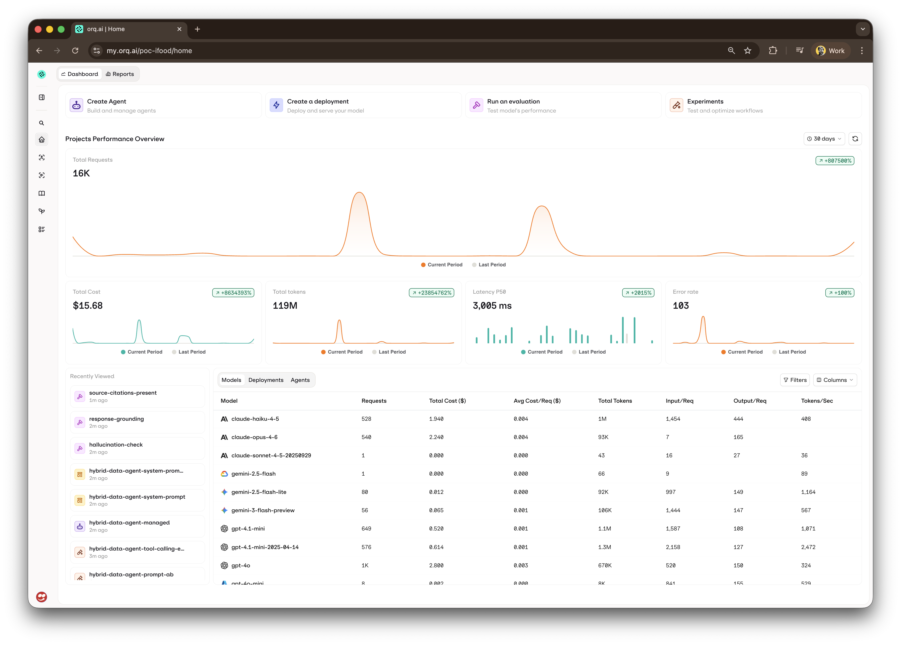

### Trace tree view

Drill into a single run to inspect inputs, outputs, token usage, and cost at
every step of the LangGraph execution.

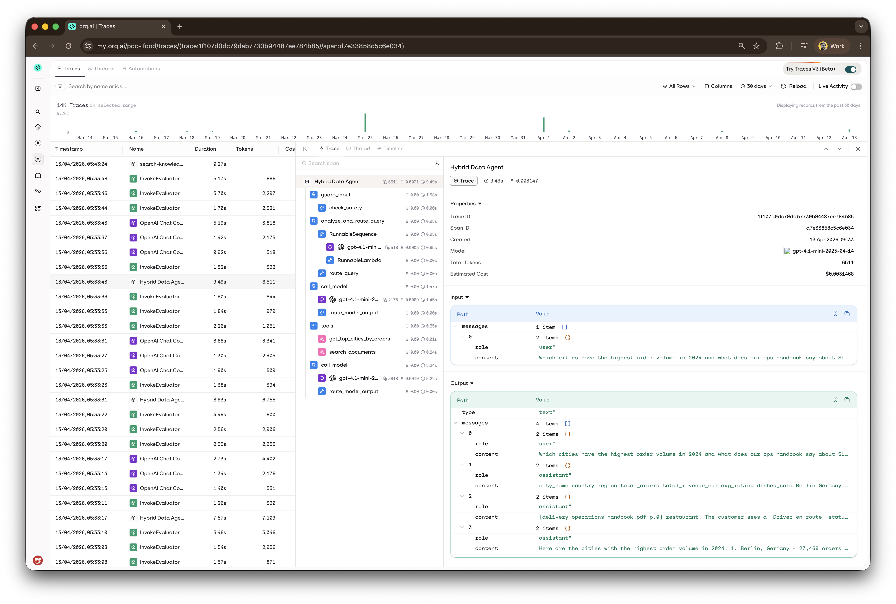

### Timeline view

View execution as a timeline to spot bottlenecks and measure step durations.


### Thread view

Follow the conversation as a message thread to review how the agent reasoned
through the problem.


## Tests, Continuous Integration and Evals

### Running Unit tests

In order to run local unit tests you have a make action already defined.  Just run:

```bash
# Run unit tests
make tests
```

### CI/CD Pipeline using Github Actions
- **Automated Testing**: Runs on every push/PR
- **Multi-Python Support**: Tests on Python 3.11 and 3.12
- **Code Quality**: Ruff linting
- **Security**: Bandit security scanning

### Evals: Integrated Evaluation Pipeline using orq.ai

Running full evaluation pipeline and testing realistic [sample questions](resources/conversation_starters.csv).

```bash
# Command to run evaluation pipeline.
# Make sure you set ORQ_API_KEY (see EVALS.md)
make evals-run
```

**Evaluation Features:**

- **Four scorers per row** — `tool-accuracy` (local), `source-citations`, `response-grounding`, `hallucination-check` (orq.ai LLM evaluators)
- **Balanced dataset** — 15 test cases split evenly across SQL-only, document-only, and mixed categories (5 each)
- **A/B mode** — same dataset against two system-prompt variants via `make evals-compare-prompts`
- **orq.ai Integration** — results sync to the Studio for per-row drill-down and cross-experiment comparison via [evaluatorq](https://docs.orq.ai/docs/experiments/api)

For detailed info on how to run evaluation pipeline, see [EVALS.md](EVALS.md).

In the Studio, the same run renders as a grid with every row color-coded per
scorer — easy to spot the one outlier without scrolling the terminal:

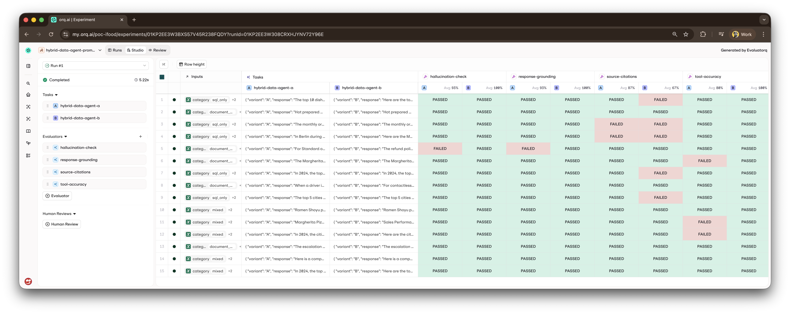

## Two ways to build the same agent

This repo ships **two implementations** of the same assistant so you can see
the trade-offs of code-first vs. Studio-first agent development:

| Approach | What it is | Run it |
|---|---|---|
| **A — LangGraph** (this repo's main agent) | Python `StateGraph` with explicit nodes, Python tools, safety guardrail | `make run` |
| **B — Managed orq.ai Agent** | Agent config lives in the orq.ai Studio, orchestration handled by the platform | `make run-orq-agent` |

Both talk to the same Knowledge Base, same model, same project. The difference
is where the orchestration logic lives.

See [`COMPARING-APPROACHES.md`](COMPARING-APPROACHES.md) for a full
side-by-side comparison and guidance on when to pick which approach.

## Swap models via the AI Router

All LLM calls are routed through `https://api.orq.ai/v2/router`, which is
OpenAI-protocol-compatible. The Studio's Models page shows every provider
the Router knows about (OpenAI, Anthropic, Google, Groq, Mistral, Cohere,
Together, etc.) with per-model pricing, context window, and capability flags:

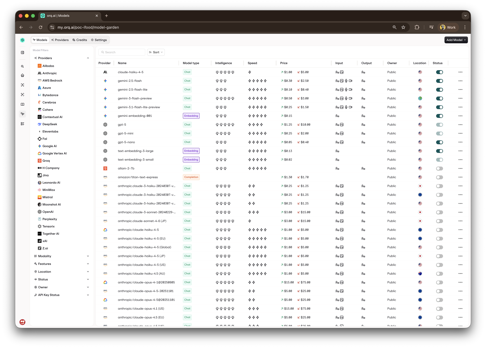

Swapping providers is a **one-line change** in `.env` — no code
modifications, no re-deploy:

```bash
# Default
DEFAULT_MODEL="openai/gpt-4.1-mini"

# Claude
DEFAULT_MODEL="anthropic/claude-sonnet-4-5"

# Groq (Llama, ultra-fast)
DEFAULT_MODEL="groq/llama-3.3-70b-versatile"

# Gemini
DEFAULT_MODEL="gemini/gemini-2.5-flash"
```

Restart `make run` and the agent uses the new provider. The orq.ai Router
handles authentication, protocol translation, cost tracking, and provider
fallbacks transparently. The trace for each run will show the exact model
name so you can compare latency, cost, and quality side-by-side in the
Traces tab.

This works because [`src/assistant/utils.py`](src/assistant/utils.py) uses
`ChatOpenAI` with the router URL regardless of the fully-specified name:

```python
return ChatOpenAI(
    model=fully_specified_name,   # e.g. "anthropic/claude-sonnet-4-5"
    api_key=os.getenv("ORQ_API_KEY"),
    base_url="https://api.orq.ai/v2/router",
)
```

## Prompt A/B testing

The system prompt is managed in orq.ai, so you can A/B test different versions
against the evaluation dataset without a code change. Each prompt lives in
the Studio as a versioned, taggable resource — edit, preview, and publish
without touching the repo:

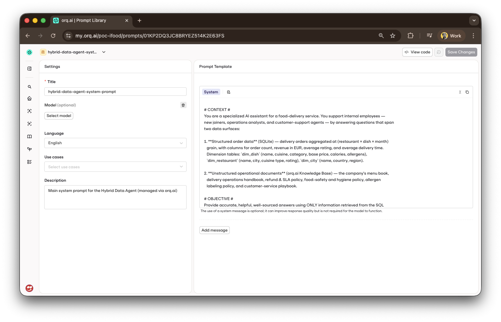

Two variants are bootstrapped by `make setup-workspace`:

- **Variant A** — the canonical, verbose prompt with grounding rules and response guidelines
- **Variant B** — a deliberately concise version that strips the verbose sections

Run the A/B experiment:

```bash
make evals-compare-prompts
```

This runs the same 15 evaluation cases twice — once per variant — using
evaluatorq's multi-job mode. All four scorers (`tool-accuracy`,
`source-citations`, `response-grounding`, `hallucination-check`) are
applied to both variants. Terminal output streams the per-row dispatch +
the final scorer breakdown for both variants:

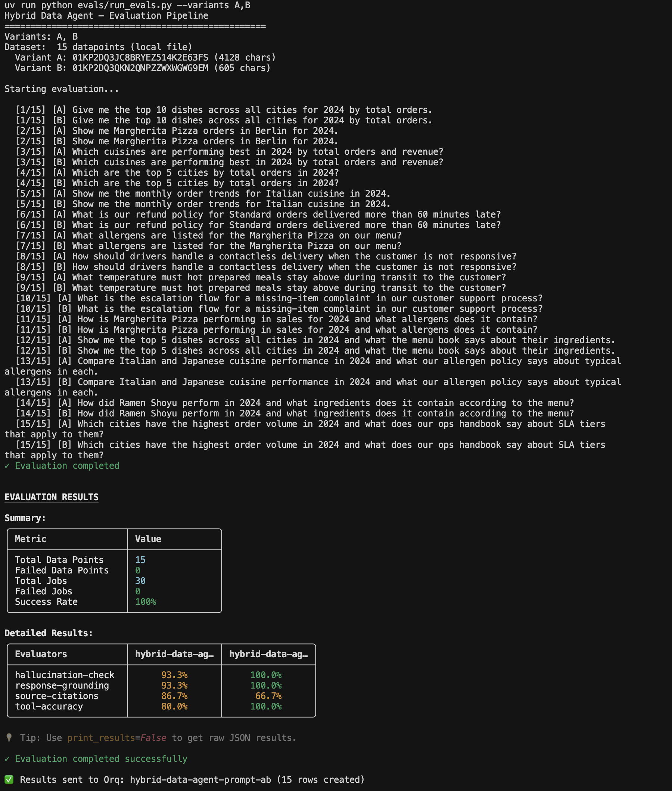

Results then sync to the orq.ai Studio as a single experiment with the
two variants side-by-side, color-coded per scorer cell so it's easy to
see which variant outperforms on which dimension.

**To iterate on a variant:** edit it directly in the orq.ai Studio
(`Onboarding-Langgraph → hybrid-data-agent-system-prompt-variant-b`), publish, then
re-run `make evals-compare-prompts`. No code change or deploy required — the
experiment picks up the latest published version.

See [`evals/run_evals.py`](evals/run_evals.py) and
[`evals/_shared.py`](evals/_shared.py) for the job factory and scorer wiring.

## Troubleshooting

**First step:** run `make doctor` — it checks every moving piece of the setup
(env vars, orq.ai reachability, KB, prompt, SQLite, test search) and prints a
clear remediation for each failure.

For known pitfalls with workarounds (SDK drift, OTEL flushing, KB quirks,
dotenv parsing, etc.), see [TROUBLESHOOTING.md](TROUBLESHOOTING.md).

**Missing data:**
```bash
make ingest-data  # Load the SQLite database and ingest PDFs into the orq.ai Knowledge Base
```
---

## Improvements and Next Steps
- **Contextual Retrieval**: Better document chunking with improved summaries
- **Reranking**: Semantic reranking to improve document retrieval relevance
- **User Feedback**: Collect user feedback in the UI (thumbs up/down)
- **Query Suggestions**: Provide intelligent follow-up question recommendations

----
Author: Arian Pasquali
