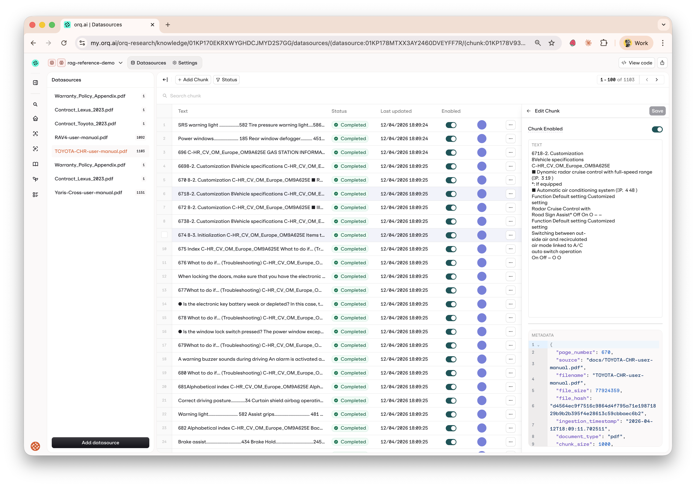
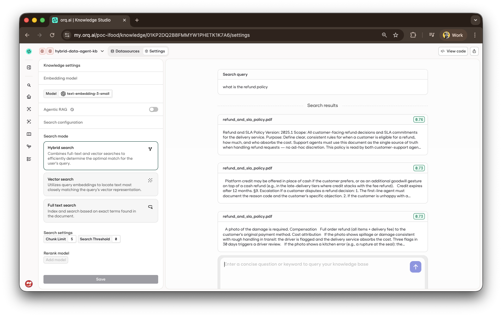
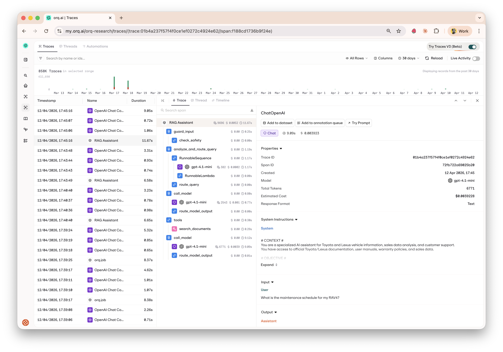
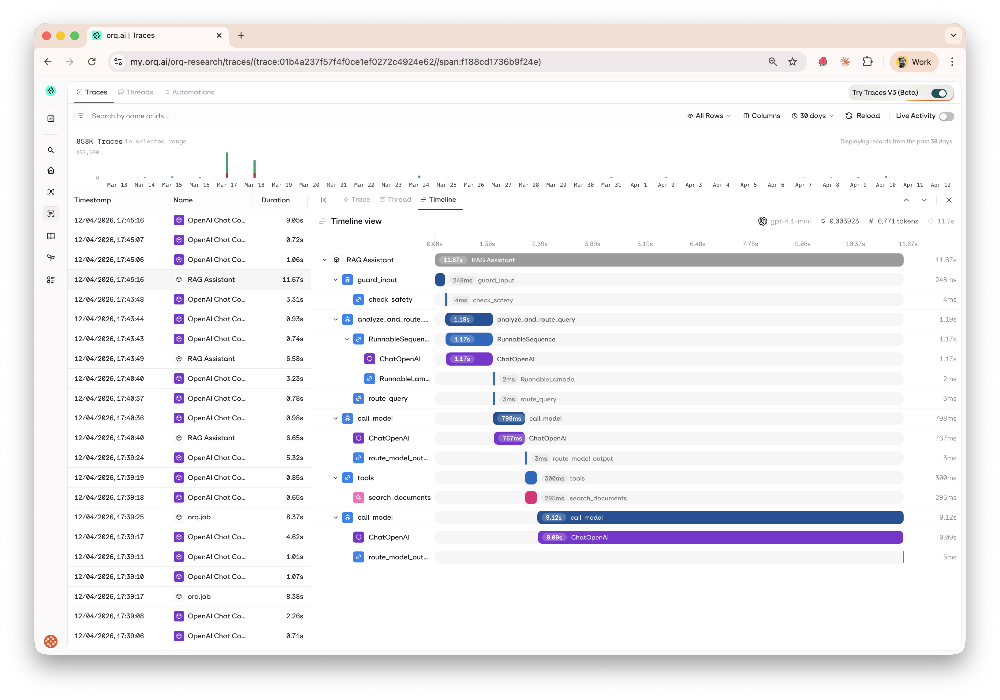
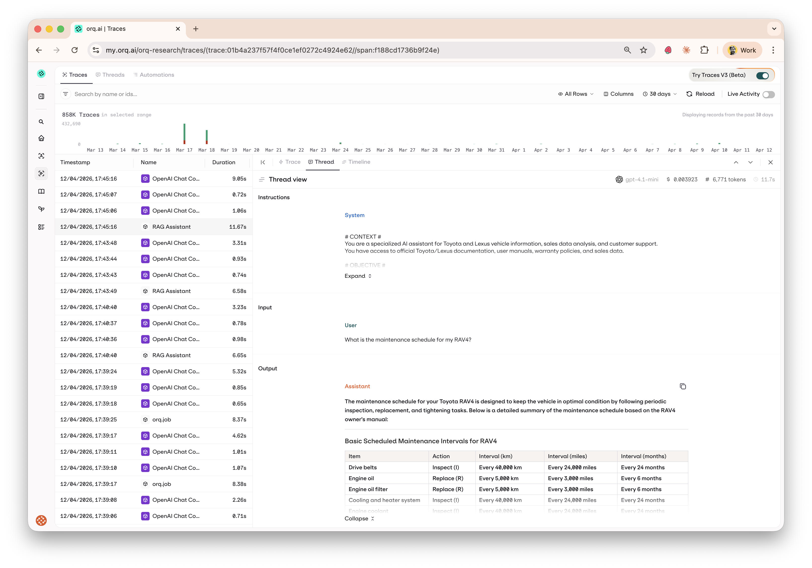
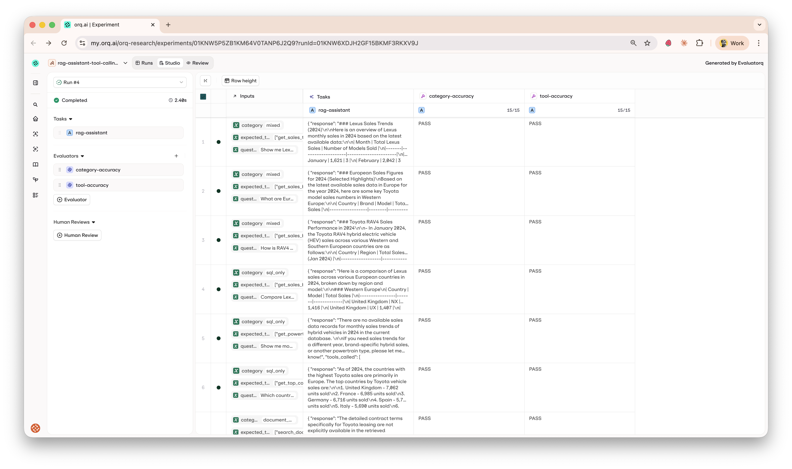

# Hybrid Data Agent — LangGraph + orq.ai reference implementation

> **A runnable reference implementation showing how to build, observe, and evaluate LangGraph agents on orq.ai.**

This repo is a working example of a LangGraph agent that reasons over both **structured data** (SQLite sales records) and **unstructured documents** (manuals, contracts, warranty policies via the orq.ai Knowledge Base), with the entire dev loop — prompts, retrieval, tracing, evaluation — managed through the orq.ai platform.

## What you'll learn

| orq.ai feature | Problem it solves | Where it lives |
|---|---|---|
| **AI Router** | Multi-provider LLM access, cost tracking, fallbacks, one-line model swaps | [`src/assistant/utils.py`](src/assistant/utils.py) — `load_chat_model()` |
| **Knowledge Base** | Managed RAG — embeddings, chunking metadata, hybrid/vector/keyword search, zero infrastructure | [`scripts/unstructured_data_ingestion_pipeline.py`](scripts/unstructured_data_ingestion_pipeline.py) (ingest) · [`src/assistant/tools.py`](src/assistant/tools.py) (search) |
| **Prompts** | Version system prompts without redeploying; A/B test changes against a dataset | [`src/assistant/prompts.py`](src/assistant/prompts.py) — `get_system_prompt()` |
| **Traces (OTEL)** | Full LangGraph execution tree with cost + latency per node, tool call, and LLM request | [`src/assistant/tracing.py`](src/assistant/tracing.py) — `setup_tracing()` |
| **evaluatorq** | Programmatic PASS/FAIL scorers, CI/CD gating, experiment comparison in the Studio | [`evals/run_evaluation_pipeline.py`](evals/run_evaluation_pipeline.py) |
| **Datasets** | Versioned test cases, reusable across experiments, growable from production traces | [`evals/datasets/tool_calling_evals.jsonl`](evals/datasets/tool_calling_evals.jsonl) |
| **Workspace bootstrap** | Idempotent one-command setup for project + KB + prompt + dataset | [`scripts/setup_orq_workspace.py`](scripts/setup_orq_workspace.py) |

See [ARCHITECTURE.md](ARCHITECTURE.md) for architecture decisions and [EVALS.md](EVALS.md) for the evaluation pipeline.

## What the agent does

- **Query structured sales data** — answers questions about vehicle sales via predefined SQL tools
- **Search unstructured documents** — semantic search over manuals, contracts, and warranty policies via the orq.ai Knowledge Base
- **Combine both** — agentic tool calling iterates between SQL and document search until it has a grounded answer
- **Stay safe** — input moderation guardrail blocks harmful content before any LLM call

## Data Sources

- **Sales Data** (SQLite): Vehicle sales by model, country, and date
- **Documents** (orq.ai Knowledge Base): Toyota manuals, contracts, and warranty policies

### Example Questions

**Using structured sales data:**
- "What were the RAV4 sales in Germany in 2024?"
- "Show me the top countries by vehicle sales"

**Using unstructured documents:**
- "What is the Toyota warranty coverage?"
- "Where is the tire repair kit in the UX?"

**Hybrid:**
- "Compare RAV4 sales and summarize its warranty"


## How it works

The assistant uses a multi-step LangGraph workflow with routing:

1. **Safety Check**: OpenAI Moderation API filters harmful content
2. **Query Analysis**: LLM classifies the question type and intent
3. **Context-Aware Routing**: Routes to appropriate response path:
   - **Toyota-specific**: If it detected that question is related to Toyota it uses 
   tools (predefined SQL queries and semantic search) to answer the question
   - **Needs clarification**: Asks for more specific information
   - **Off-topic**: Politely redirects to Toyota/Lexus topics
4. **Agentic Tool Loop**: For Toyota questions, iterates between model and tools until complete

See below the agent architecture.


For a detailed technical overview of the system architecture, see [ARCHITECTURE.md](ARCHITECTURE.md).


## Demo

### Basic Demo

Demo showing the agent using semantic search to find relevant documents.


### Sales Data Analysis Demo

Demo showing the agent using SQL capabilities to query the structured database.


## Quick Start

### Prerequisites

- **Option A (Local, recommended)**: Python 3.11+ and [uv](https://docs.astral.sh/uv/)
- **Option B (Docker)**: Docker and Docker Compose (for running the app only — bootstrap + ingest still run on the host)

**Required API keys** (set in `.env` before running any setup command):
- `OPENAI_API_KEY` — for LLM + embedding generation (ingestion)
- `ORQ_API_KEY` — for orq.ai observability, evaluation, Knowledge Base, and prompts
- `ORQ_PROJECT_NAME` — orq.ai project where datasets, experiments, prompts, and KBs live

**Bootstrap outputs** (populated by `make setup-workspace` — see below):
- `ORQ_KNOWLEDGE_BASE_ID` — ID of the Knowledge Base that holds the ingested PDFs
- `ORQ_SYSTEM_PROMPT_ID` — ID of the system prompt managed in the orq.ai Studio

### Option A: Local Development (Recommended)

1. **Install dependencies**
```bash
uv sync
```

2. **Configure environment**
```bash
cp .env.example .env
# Edit .env and set OPENAI_API_KEY, ORQ_API_KEY, and ORQ_PROJECT_NAME
```

3. **Bootstrap the orq.ai workspace**
```bash
# Idempotent: creates (or reuses) the project, Knowledge Base, system
# prompt, and evaluation dataset under ORQ_PROJECT_NAME, then prints a
# paste-safe block of IDs for your .env file.
make setup-workspace
```

Example output:
```
[1/4] Project 'langgraph-demo'
  → created new project: 019...
[2/4] Knowledge Base 'hybrid-data-agent-kb'
  → created new KB: 01K...
[3/4] System prompt 'hybrid-data-agent-system-prompt'
  → created new prompt: 01K...
[4/4] Evaluation dataset 'hybrid-data-agent-tool-calling-evals'
  → created new dataset: 01K...

# Paste the block below into your .env file (safe to paste as-is).
# ───────────────────────────────────────────────────────────────
ORQ_KNOWLEDGE_BASE_ID="01K..."
ORQ_SYSTEM_PROMPT_ID="01K..."
# Dataset ID (not read by the app, informational only):
# ORQ_DATASET_ID=01K...
# ───────────────────────────────────────────────────────────────
```

Copy the block into your `.env` file.

4. **Ingest data sources**
```bash
# Loads the SQLite sales database and ingests PDFs into the Knowledge
# Base you just bootstrapped. Runs `ingest-sql` + `ingest-kb`.
make ingest-data
```

5. **Run the UI**
```bash
# Web interface. Runs Chainlit UI locally
make run
```
Visit `http://localhost:8000` to chat with the assistant.


6. **Run the agent using LangGraph Studio**

```bash
# Opens LangGraph Studio UI running our Agent
make dev
```

LangGraph Studio should automatically open in your browser.


### Option B: Docker

Docker is useful once the workspace is bootstrapped and data is ingested.
The container only runs the Chainlit app — it doesn't run setup-workspace
or ingest-data, so make sure those are done first from your host machine.

```bash
# 1. Bootstrap and ingest from the host (see Option A steps 1–4)
make setup-workspace   # then paste IDs into .env
make ingest-data

# 2. Build and run the container
docker-compose up --build
# or
docker build -f Dockerfile -t hybrid-data-agent .
docker run -p 8000:8000 --env-file .env hybrid-data-agent
```

Visit `http://localhost:8000` to chat with the assistant.


## Document Ingestion

Ingest PDF documents into an orq.ai Knowledge Base for semantic retrieval.
Local chunking is done with PyPDF + `RecursiveCharacterTextSplitter`, then
chunks are uploaded to orq.ai which handles embeddings and vector search.

```bash
# Ingest PDFs from ./docs directory into the orq.ai Knowledge Base
make ingest-kb
```

**First run:** if `ORQ_KNOWLEDGE_BASE_ID` is not set in `.env`, `make setup-workspace`
should have created it for you already. If you skipped setup-workspace, `ingest-kb`
will auto-create a KB and print its ID — paste it into `.env` to reuse on subsequent runs.

### Inspecting ingested chunks

After ingestion, open the Knowledge Base in the orq.ai Studio to browse each
datasource (one per PDF) and inspect individual chunks with their metadata.



### Testing Knowledge Base search

Use the built-in search playground to verify retrieval quality — tweak
hybrid/vector/keyword modes and thresholds — before wiring the KB to the agent.



## Observability

Every LangGraph execution (from the Chainlit UI, eval runs, or direct
invocation) is traced to the orq.ai Studio via OpenTelemetry. The full graph
tree is captured — nodes, LLM calls, tool executions, and Knowledge Base
retrievals — with token usage and cost per step.

See [`src/assistant/tracing.py`](src/assistant/tracing.py) for the OTEL setup
that makes this work.

### Trace tree view

Drill into a single run to inspect inputs, outputs, token usage, and cost at
every step of the LangGraph execution.



### Timeline view

View execution as a timeline to spot bottlenecks and measure step durations.



### Thread view

Follow the conversation as a message thread to review how the agent reasoned
through the problem.



## Tests, Continuous Integration and Evals

### Running Unit tests

In order to run local unit tests you have a make action already defined.  Just run:

```bash
# Run unit tests
make tests
```

### CI/CD Pipeline using Github Actions
- **Automated Testing**: Runs on every push/PR
- **Multi-Python Support**: Tests on Python 3.11 and 3.12
- **Code Quality**: Ruff linting
- **Security**: Bandit security scanning

### Evals: Integrated Evaluation Pipeline using orq.ai

Running full evaluation pipeline and testing realistic [sample questions](resources/converstation_starters.csv).

```bash
# Command to run evaluation pipeline.
# Make sure you set ORQ_API_KEY (see EVALS.md)
make evals-run
```

**Evaluation Features:**

- **Tool Selection Accuracy**: Measures correct tool usage
- **Category Performance**: SQL-only, document-only, mixed queries
- **orq.ai Integration**: Results tracking, experiment comparison, and analysis via [evaluatorq](https://docs.orq.ai/docs/experiments/api)
- **15 Test Cases**: Comprehensive evaluation dataset (5 expecting SQL queries, 5 expecting semantic search, and 5 mixed queries using both)

For detailed info on how to run evaluation pipeline, see [EVALS.md](EVALS.md).



## Swap models via the AI Router

All LLM calls are routed through `https://api.orq.ai/v2/router`, which is
OpenAI-protocol-compatible. Swapping providers is a **one-line change** in
`.env` — no code modifications, no re-deploy:

```bash
# Default
DEFAULT_MODEL="openai/gpt-4.1-mini"

# Claude
DEFAULT_MODEL="anthropic/claude-sonnet-4-5"

# Groq (Llama, ultra-fast)
DEFAULT_MODEL="groq/llama-3.3-70b-versatile"

# Gemini
DEFAULT_MODEL="gemini/gemini-2.5-flash"
```

Restart `make run` and the agent uses the new provider. The orq.ai Router
handles authentication, protocol translation, cost tracking, and provider
fallbacks transparently. The trace for each run will show the exact model
name so you can compare latency, cost, and quality side-by-side in the
Traces tab.

This works because [`src/assistant/utils.py`](src/assistant/utils.py) uses
`ChatOpenAI` with the router URL regardless of the fully-specified name:

```python
return ChatOpenAI(
    model=fully_specified_name,   # e.g. "anthropic/claude-sonnet-4-5"
    api_key=os.getenv("ORQ_API_KEY"),
    base_url="https://api.orq.ai/v2/router",
)
```

## Prompt A/B testing

The system prompt is managed in orq.ai, so you can A/B test different versions
against the evaluation dataset without a code change. Two variants are
bootstrapped by `make setup-workspace`:

- **Variant A** — the canonical, verbose prompt with grounding rules and response guidelines
- **Variant B** — a deliberately concise version that strips the verbose sections

Run the A/B experiment:

```bash
make evals-compare-prompts
```

This runs the same 15 evaluation cases twice — once per variant — using
evaluatorq's multi-job mode. Both scorers (`tool-accuracy`, `category-accuracy`)
are applied to both variants, and the results sync to orq.ai Studio as a
single experiment with two columns.

**To iterate on a variant:** edit it directly in the orq.ai Studio
(`langgraph-demo → hybrid-data-agent-system-prompt-variant-b`), publish, then
re-run `make evals-compare-prompts`. No code change or deploy required — the
experiment picks up the latest published version.

See [`evals/run_prompt_experiment.py`](evals/run_prompt_experiment.py) for the
job definitions and scorer wiring.

## Troubleshooting

**First step:** run `make doctor` — it checks every moving piece of the setup
(env vars, orq.ai reachability, KB, prompt, SQLite, test search) and prints a
clear remediation for each failure.

For known pitfalls with workarounds (SDK drift, OTEL flushing, KB quirks,
dotenv parsing, etc.), see [TROUBLESHOOTING.md](TROUBLESHOOTING.md).

**Missing data:**
```bash
make ingest-data  # Load the SQLite database and ingest PDFs into the orq.ai Knowledge Base
```
---

## Improvements and Next Steps
- **Contextual Retrieval**: Better document chunking with improved summaries
- **Reranking**: Semantic reranking to improve document retrieval relevance
- **User Feedback**: Collect user feedback in the UI (thumbs up/down)
- **Query Suggestions**: Provide intelligent follow-up question recommendations

----
Author: Arian Pasquali